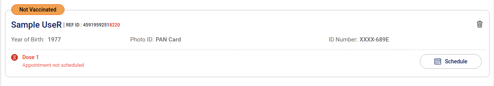

## HackCoWin

### Requirements

1. This app requires an auth token, which can be generated after the OTP validation on cowin.com.
To get the auth token, open up the developer tools and find respective api calls, get token from authorization header.
Token should be of the form `<Token>` without "Bearer" in it. 
NOTE: This token is valid for 15 mins as of 6th May 2021
2. Get the reference IDs of the users to book the slots for. 
Reference ID is indicated by "REF ID" as shown below:

Note: Get Beneficiary API is already the part of the code, you may use it to get REF ID

### Use

In `main.go` file, add following fields:
```go
// beneficiary is the list of users' reference ids to book the slots for
var beneficiary []string = []string{"reference-id1", "reference-id2", "reference-id3"}
// After OTP validation on covid, copy the auth token from `authorization` header inside the api call /beneficiary in developer console
auth := "<auth-token>"
// Add the pin-code of the place to refer the centers around
pin := "123456"
// This should be today's date
date := "DD-MM-YYYY"
```

### Update

Recently coWin has updated one more step in the booking i.e. to include captcha. Which invalidated the previous script. <br>
After a bit of research, it turned out that the captcha generation requires only auth token and nothing else, which 
hints us that we can generate the captcha right after we generate the auth token. Hence the code is updated for the same.<br>
In the new version, after you run the script like before, at the first step, the script downloads the captcha generated with provided auth token. 
And asks you to read and input the same (correctly without spaces) in the console. After that the script runs like before. Tested! 
